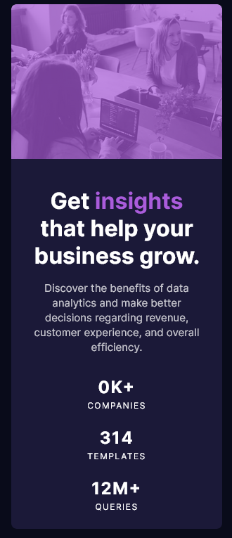

# Frontend Mentor - Stats preview card component solution

This is a solution to the [Stats preview card component challenge on Frontend Mentor](https://www.frontendmentor.io/challenges/stats-preview-card-component-8JqbgoU62). Frontend Mentor challenges help you improve your coding skills by building realistic projects.

## Table of contents

- [Overview](#overview)
  - [The challenge](#the-challenge)
  - [Screenshot](#screenshot)
  - [Links](#links)
- [Author](#author)
- [Acknowledgments](#acknowledgments)

**Note: Delete this note and update the table of contents based on what sections you keep.**

## Overview

### The challenge

Users should be able to:

- View the optimal layout depending on their device's screen size

### Screenshot

### Links

- Live Site URL: [live](https://leandrnvs.github.io/Stats-preview-card-component/)

## Author

- Website - [in progress](https://www.your-site.com)
- Frontend Mentor - [@leandrNvs](https://www.frontendmentor.io/profile/leandrNvs)
- Linkedin - [contact me](https://www.linkedin.com/in/leandrnvs/)
